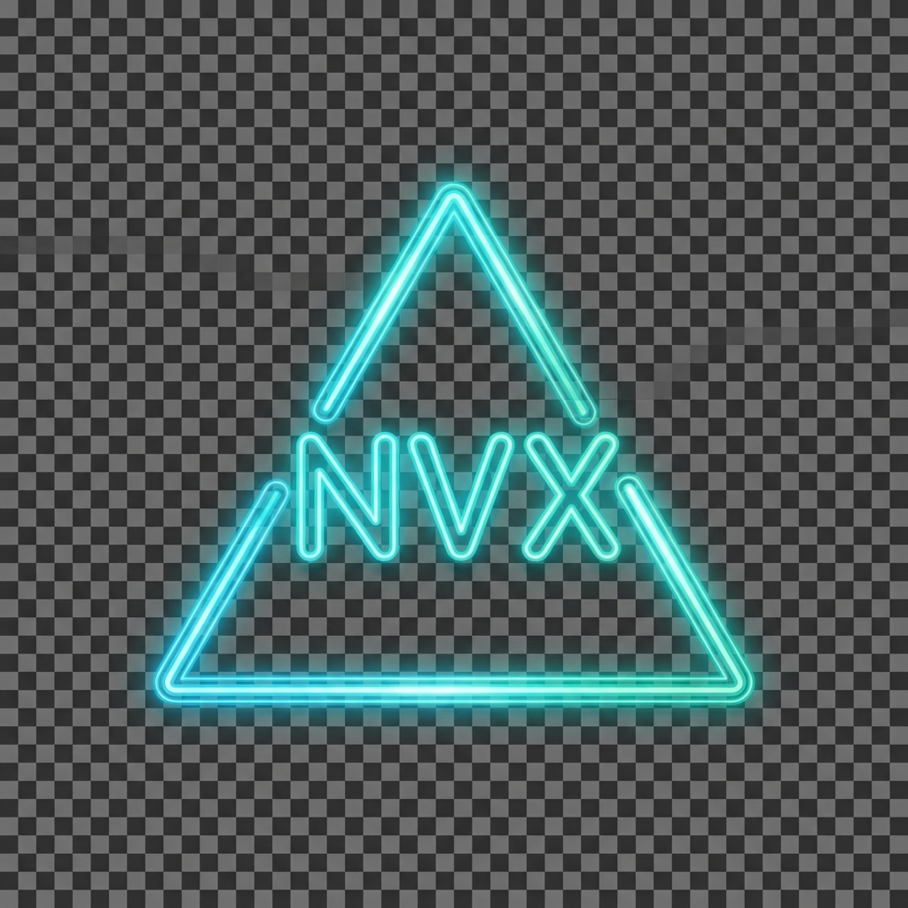

# NVX Movies 🎬

**NVX Movies** is a cutting-edge, cinematic movie discovery web application built with **Next.js 15**, **React 19**, and **Shadcn UI**. It features a stunning, immersive dark-mode interface designed to provide a premium user experience comparable to top-tier streaming platforms.



## ✨ Key Features

### 🎨 Cinematic User Interface
- **Immersive Hero Section**: Edge-to-edge full-screen carousel with gradient masking and dynamic typography.
- **Neon Aesthetics**: Custom "Cyberpunk" design language with cyan glows, glassmorphism, and deep radial backgrounds.
- **Fluid Animations**: Smooth entrance animations, hover zoom effects, and native-like fluid scrolling.

### 🚀 High-Performance Interaction
- **Interactive Carousels**: All content lists (Trending, Popular, Categories) use advanced touch-friendly carousels (`embla-carousel`).
- **Responsive Design**: Flawless layout adaptation from mobile phones to large desktop screens.
- **Optimized Media**: Next.js Image optimization with consistent 16:9 aspect ratios and object-fit handling.

### 🛠 Enterprise-Grade Architecture
- **Tech Stack**: Next.js 15 (App Router), TypeScript, Tailwind CSS, Shadcn UI, Lucide Icons.
- **Strict Typing**: Full TypeScript coverage with strictly defined interfaces.
- **Modular Codebase**: Clean separation of concerns (`components/layout`, `components/features`, `utils`).
- **Robust Error Handling**: Custom Error Boundaries and 404 Not Found pages.

## 🚀 Getting Started

### Prerequisites
- Node.js > 18.17.0 (Recommended: v24.x)
- npm or yarn

### Installation

1.  **Clone the repository**
    ```bash
    git clone https://github.com/your-username/nvx-web-movies.git
    cd nvx-web-movies
    ```

2.  **Install dependencies**
    ```bash
    npm install
    ```

3.  **Environment Setup**
    Create a `.env.local` file in the root directory and add your TMDB API key:
    ```env
    NEXT_PUBLIC_TMDB_API_KEY=your_tmdb_api_key_here
    ```

4.  **Run the development server**
    ```bash
    npm run dev
    ```
    Open [http://localhost:3000](http://localhost:3000) with your browser to see the result.

## 📦 Build & Deploy

To create a production build:

```bash
npm run build
```

This project is optimized for deployment on **Vercel**.

## 📄 License
This project is open-source and available under the MIT License.

---
*Built with ❤️ by NVX Team*